# Report for Assignment 1 resit

## Project chosen : flask-sqlalchemy

Name: Melih Şengül

URL: https://github.com/melotelo/flask-sqlalchemy

Number of lines of code and the tool used to count it: I have used lizard to count the lines and the languages were %100 python thus it was suitable to use lizard. The counting tool was run through the command **lizard** on the terminal.

Here were the results:
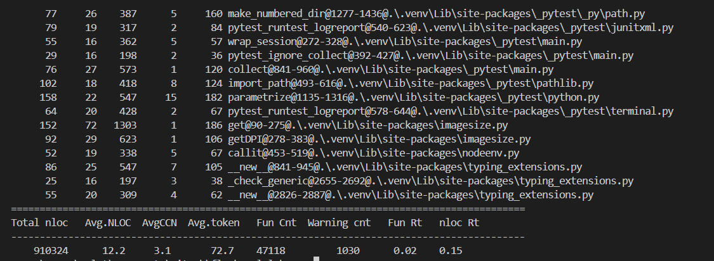

Total nloc was 910324, which is around 910.3 KLOC. Because there are so many lines I can’t put all of them here, I can only put a few lines and the results.

Programming language: Python %100
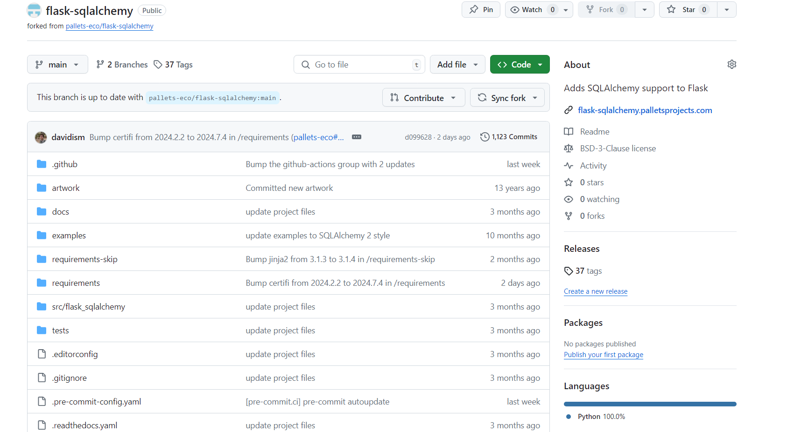
As seen here too.

## Coverage measurement with existing tool

The coverage tool that was used was coverage.py as the codes were written in python **coverage.py** was a suitable option.

First, I have installed coverage with **pip** **install** **coverage** on vscode windows terminal. Then I ran **coverage** **run** **-m** **pytest** **tests** **-s** to get the coverage how much of the codes get covered by the tests.
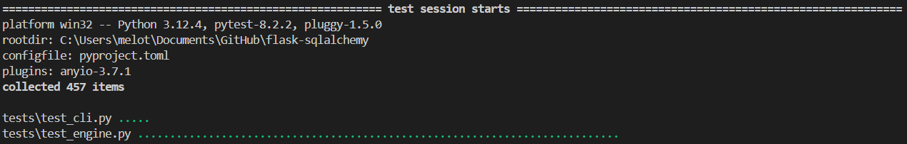

Then I ran **coverage** **report** to get the report.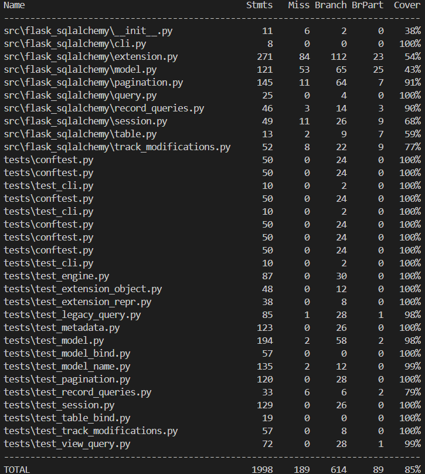

Then I ran the command **coverage** **html** to get a better view which gave me a chance to look at a html document.
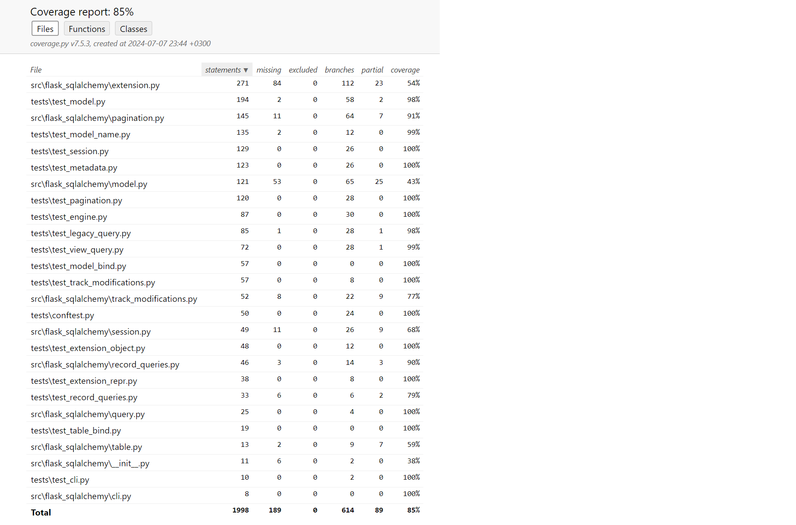

Here I identified the files that could be improved on coverage. I realized that with the functions view I could get a better look at which functions could be improved.
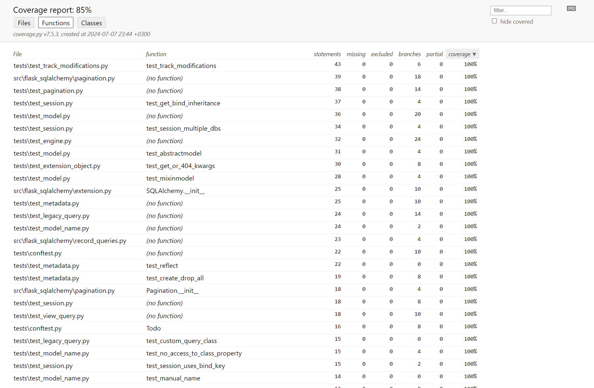

I identified the 2 functions in the file extension.py I could improve, the ones circled with red.
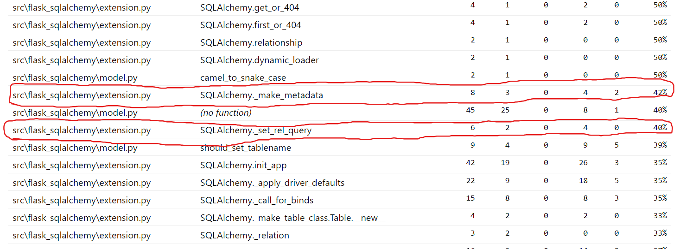
Selected functions were these:

1. def \_make_metadata(self, bind_key: str \| None) -\> sa.MetaData:
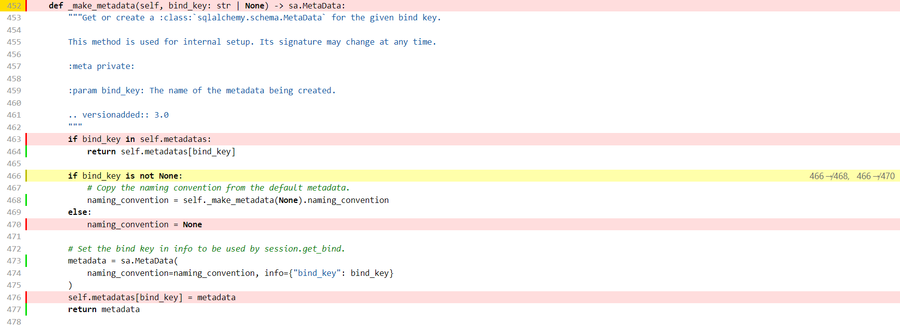
2. def \_set_rel_query(self, kwargs: dict\[str, t.Any\]) -\> None:
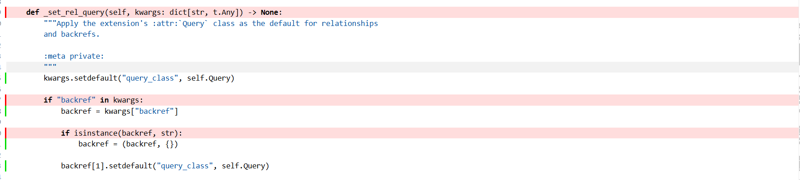
As we can see these function branches are not fully covered. Thus, I added certain changes to the extensions.py file to hold the flags for each branch while storing them inside a dictionary. I also created my own test file which would be used to cover the missing branches in both of the functions. Adding my own test file was necessary as none of the tests were covering these functions.

## Coverage improvement

This is the screenshot of the changes on file extension.py which included the functions that were chosen. Here with the changes on the file my own coverage tool is created.
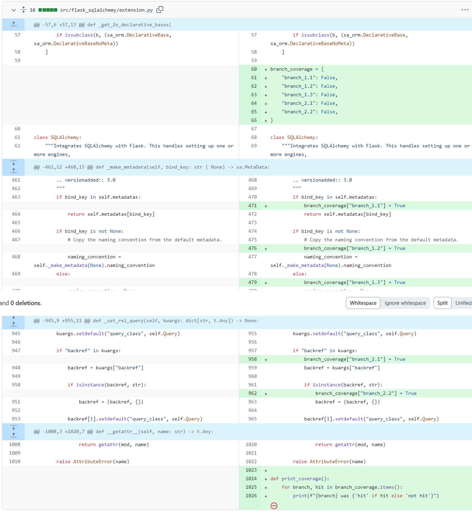

Link: [made coverage · pallets-eco/flask-sqlalchemy@094255d (github.com)](https://github.com/pallets-eco/flask-sqlalchemy/commit/094255d6d010addc80d2556e53d8f6c2a713130e#diff-bc2a74295364ce4cb56f3892dea01d85406592b5a2e19b84bb548ffd06e29065)

The branch_coverage dictionary is initialized in extension.py to track the coverage of different branches.

The \_make_metadata and \_set_rel_query functions in SQLAlchemy class are instrumented to update the branch_coverage dictionary when each branch is executed.

### Individual tests

The test file **test_extension.py** that I created, includes tests for both of the functions and used for printing the coverage of the branches:
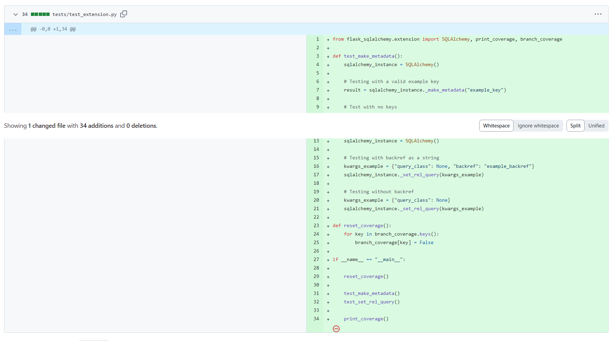

> Link: [final · pallets-eco/flask-sqlalchemy@9cf5f7e (github.com)](https://github.com/pallets-eco/flask-sqlalchemy/commit/9cf5f7e4b4e6a313dae280d91a5fe7516ccb621e)

For improving coverage for Function 1(def \_make_metadata(self, bind_key: str \| None) -\> sa.MetaData:):

> I implemented **test_make_metadata:** Which
>
> ● Creates an instance of SQLAlchemy.
>
> ● Calls \_make_metadata with a valid key ("example_key") to ensure branch_1.1 and branch_1.2 are hit.
>
> ● Calls \_make_metadata with None to ensure branch_1.3 is hit.

For improving coverage for Function 2(def \_set_rel_query(self, kwargs: dict\[str, t.Any\]) -\> None:):

> I implemented **test_set_rel_query:** Which
>
> ● Creates an instance of SQLAlchemy.
>
> ● Calls \_set_rel_query with kwargs containing a backref as a string to ensure branch_2.1 and branch_2.2 are hit.
>
> ● Calls \_set_rel_query with kwargs not containing a backref to ensure branch_2.1 is hit without hitting branch_2.2.

The **reset_coverage** function resets the branch_coverage dictionary before running tests to ensure accurate tracking for each test run.

> The tests are executed by calling **test_make_metadata** and **test_set_rel_query**. After running the tests, the **print_coverage** function prints the final coverage report

of my own tool indicating which branches were hit.

To see if the implemented tests were successful the code was run and was successful. As seen on the following picture below.
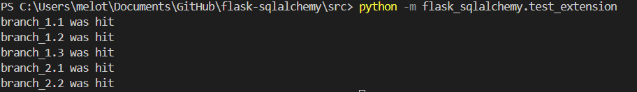

To see if it was also true in the coverage tool **coverage.py** the coverage tool was run again. Here are the changes from old coverage results to new coverage results:

> **Old** **Coverage** **Results** **:**

1. def \_make_metadata(self, bind_key: str \| None) -\> sa.MetaData:

2. def \_set_rel_query(self, kwargs: dict\[str, t.Any\]) -\> None:

> **New** **Coverage** **Results:**
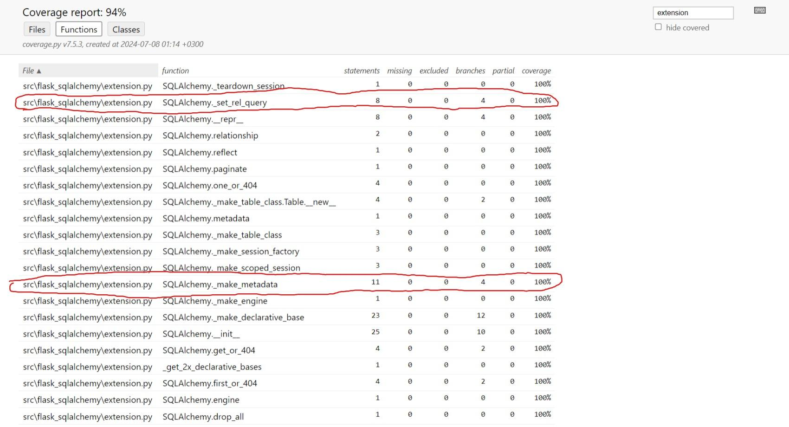

1. def \_make_metadata(self, bind_key: str \| None) -\> sa.MetaData:
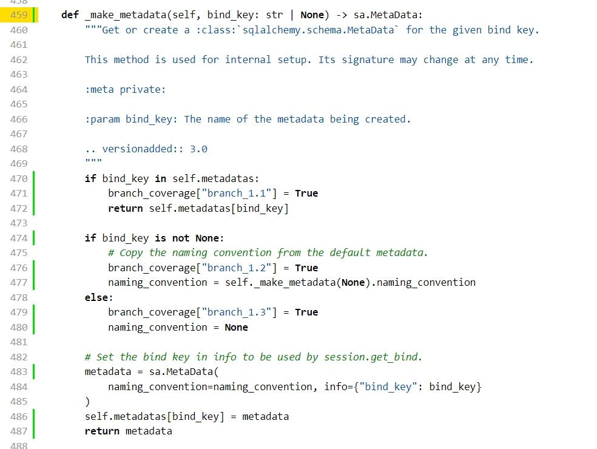

2. def \_set_rel_query(self, kwargs: dict\[str, t.Any\]) -\> None:
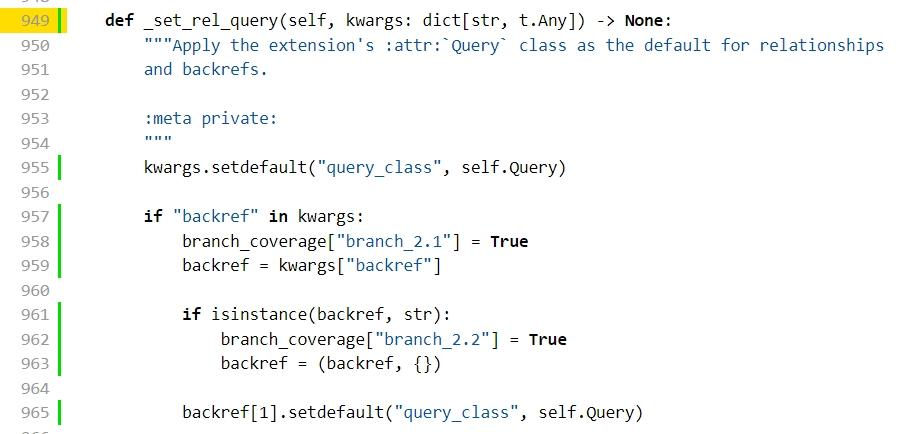
As it can be seen, the coverage of the functions were significantly improved.

Function **def** **\_make_metadata(self,** **bind_key:** **str** **\|** **None)** **-\>** **sa.MetaData:** got improved from **%42** to **%100**.

Function **def** **\_set_rel_query(self,** **kwargs:** **dict\[str,** **t.Any\])** **-\>** **None:** got improved from **%40** to **%100**.

This shows that added tests were successful for covering the missing branches.

> ● **branch_1.1**: Hit when \_make_metadata is called with a key that exists in self.metadatas.
>
> ● **branch_1.2**: Hit when \_make_metadata is called with a non-None key that does not exist in self.metadatas.
>
> ● **branch_1.3**: Hit when \_make_metadata is called with None.
>
> ● **branch_2.1**: Hit when \_set_rel_query is called with kwargs containing backref.
>
> ● **branch_2.2**: Hit when \_set_rel_query is called with kwargs containing backref as a string.

### Overall

**Old** **Coverage** **Results:**

**New** **Coverage** **Results:**
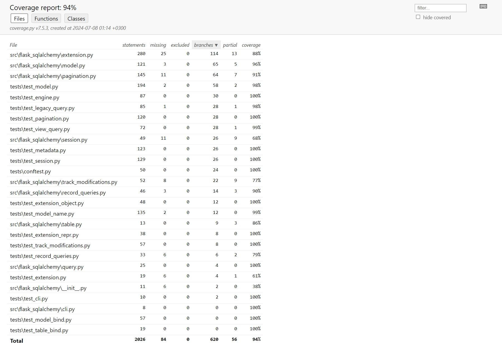
